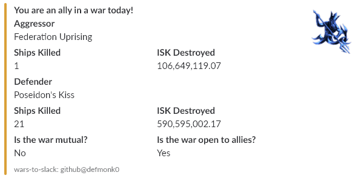

# wars-to-slack

Post your active wars to [Slack](https://slack.com/) using local [Node.js](https://nodejs.org/) or [AWS Lambda](https://aws.amazon.com/lambda/).

## Installation

### Local Node.js

- Clone the git repository. `git clone https://github.com/defmonk0/wars-to-slack.git`
- Navigate into the created 'wars-to-slack' directory. `cd wars-to-slack`
- Install all dependencies using [npm](https://www.npmjs.com/). `npm install`
- Edit the configuration file to meet your needs (see [Environment Variables](#environment-variables)).
- Run the project using [npm](https://www.npmjs.com/) as well. `npm run start`
- If you want additional resistance to failure, consider using a node process manager.

### AWS Lambda

#### Using Releases

- Download the latest `Lambda.zip` from the [releases page](https://github.com/defmonk0/wars-to-slack/releases).
- Create a new function in [AWS Lambda](https://aws.amazon.com/lambda/).
	- Use "Author from scratch".
	- The name is up to you.
	- Use Node.js 6.10 as your runtime.
	- The role you use shouldn't need any special permissions.
- After creating the function, upload your Lambda.zip file.
	- In the "Function code" section, you can change "Code entry type" drop-down to "Upload a .ZIP file".
	- Click the button, select your zip file, and then click the "Save" button in the top right of the window.
- Set up your environment variables to meet your needs (see [Environment Variables](#environment-variables)).
- Set up a trigger for your new function, or select an existing one.
	- In the "Designer" section, select "CloudWatch Events" on the left.
	- In the "Configure triggers" section, select "Create a new rule" from the drop-down (or select an existing one).
	- Supply a name and description however you want. This will be reusable in the future.
	- Supply a "Schedule expression" for how often you want the script to run. `rate(5 minutes)`
	- Click the "Add" button, and then click the "Save" button in the top right of the window.

#### Build From Master

- Clone the git repository. `git clone https://github.com/defmonk0/wars-to-slack.git`
- Navigate into the created 'wars-to-slack' directory. `cd wars-to-slack`
- Install all dependencies using [npm](https://www.npmjs.com/). `npm install`
- Build a Lambda.zip using [npm](https://www.npmjs.com/) as well. It will be created in the "lambda" directory. `npm run build`
- Continue following the instructions for [Using Releases](#using-releases), ignoring the first step to download a release zip.

## Configuration

### Setup Instructions

#### Local Node.js

Simply edit the JSON file given in the node directory. `./node/config/environmentVariables.json`

#### AWS Lambda

While editing a [Lambda](https://aws.amazon.com/lambda/) function, the "Environment variables" section allows you to supply key-value pairs. Create a key for each of the entries needed, and supply an associated value.

### Available Variables

- [required] channel (string)

	The slack channel you wish to post to.

	`"#channel-name"`

- [required] slackHookURL (string)

	The [Webhook URL](https://api.slack.com/incoming-webhooks) for your Slack [Custom Integration](https://slack.com/apps/manage/custom-integrations).

	`"https://hooks.slack.com/services/YOUR/SLACK/HOOK"`

- [required] allianceIds (string)

	An comma separated list of Alliance IDs for which you would like to track wars.

	`"123, 456, 789"`

- [required] corporationIds (string)

	An comma separated list of Corporation IDs for which you would like to track wars.

	`"123, 456, 789"`

## Example Slack Post

